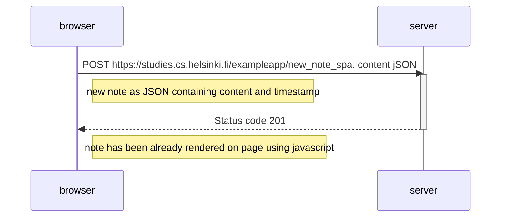

```mermaid
sequenceDiagram
participant browser
participant server

    browser->>server: POST https://studies.cs.helsinki.fi/exampleapp/new_note_spa. content jSON
    activate server
    Note right of browser: new note as JSON containing content and timestamp
    server-->>browser: Status code 201
    deactivate server
    Note right of browser: note has been already rendered on page using javascript
```
